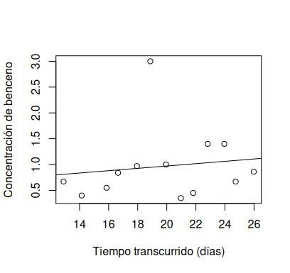
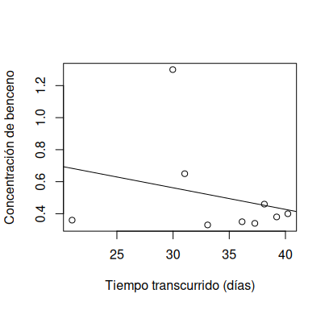
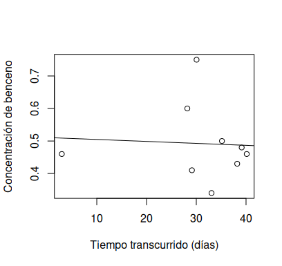
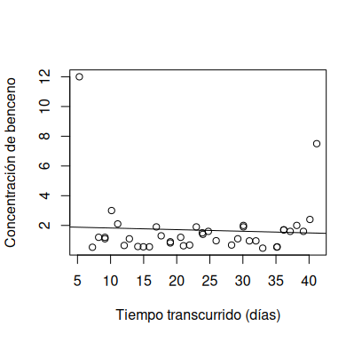
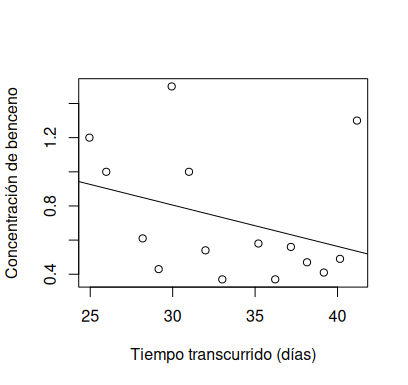
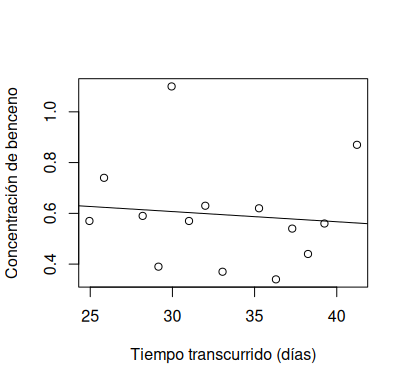
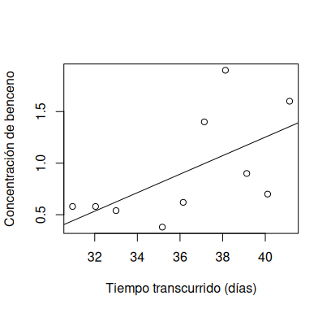
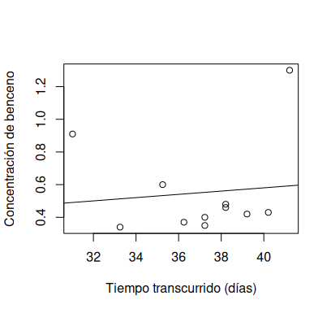

\newpage

# Laboratorio de estadística.

Fuente original: <https://www.nature.com/articles/d41586-023-00820-9>

## Introducción.

<p style="text-align:justify; text-justify: auto;">En el presente laboratorio,
estudiamos la difusión de gases tóxicos en el aire, a partir del incidente
ocurrido en Ohio el 3 de febrero de 2023.</p>

<p style="text-align:justify; text-justify: auto;">En dicha fecha, un tren de
mercancías con 20 vagones cargados de mercancías peligrosas descarriló liberando
estas sustancias, que se evaporaron y difundieron por el aire. Además, las
autoridades realizaron una quema controlada de la mercancía restante,
propiciando que los gases tóxicos multiplicaran su concentración en el aire,
causando problemas a la población.</p>

<p style="text-align:justify; text-justify: auto;">Lo que haremos es sacar
ciertos parámetros estadísticos para poder comprobar cómo ha sido la difusión de
estos compuestos volátiles en el área afectada, viendo la media de la
concentración en los respectivos días y dependiendo de las ubicaciones e
intentando encontrar una tendencia para ver si la concentración tiene visos de
descender a medio plazo.</p>

<p style="text-align:justify; text-justify: auto;">Analizaremos el residuo de
Benceno que quedó dispersado en el aire. No era el compuesto más peligroso, en
comparación con otros como el *cloruro de vinilo*. Sin embargo, supone un riesgo
para la salud de las personas que están en la zona.</p>

<p style="text-align:justify; text-justify: auto;">Para poder realizar el
proceso que arriba especificamos, utilizaremos el programa R, con fragmentos de
código que quedarán en el presente documento.</p>

## Metodología.

El método que hemos utilizado es el siguiente, enumerado según ha ocurrido:

* En primer lugar, hemos aislado los datos de <https://www.epa.gov/system/files/other-files/2023-02/Lab_Results_Air.csv> (la base de datos que utilizaremos) según su ubicación, obteniendo sendos archivos CSV para cada lugar.

  * <https://jmarialearning.github.io/repo/acts/labstat/data/A-01.csv> Lugar 1.
  * <https://jmarialearning.github.io/repo/acts/labstat/data/DW.csv> Lugar 2.
  * <https://jmarialearning.github.io/repo/acts/labstat/data/UW.csv> Lugar 3.
  * <https://jmarialearning.github.io/repo/acts/labstat/data/WA-01.csv> Lugar 4.
  * <https://jmarialearning.github.io/repo/acts/labstat/data/WA-02.csv> Lugar 5.
  * <https://jmarialearning.github.io/repo/acts/labstat/data/WA-03.csv> Lugar 6.
  * <https://jmarialearning.github.io/repo/acts/labstat/data/WA-04.csv> Lugar 7.
  * <https://jmarialearning.github.io/repo/acts/labstat/data/WA-05.csv> Lugar 8.

* Hemos creado una columna extra en cada CSV, llamada *Differential*, en la que hemos puesto la diferencia (en días) entre la medición y el accidente. Así podremos comparar la expansión del Benceno en el tiempo.

* Importamos los datos en R utilizando la librería `readr` y, en concreto, su instrucción `import_csv`. Así, podremos trabajar con ellos en R.

* Al tener los datos importados, utilizaremos el comando `mean()` para calcular la media de un conjunto de datos.

* Podemos también ver a tendencia de esos datos calculando una *recta de ajuste* de los datos que obtenemos. Así podremos comprobar en qué zonas se ha pasado el pico de concentración, disminuyendo esta, y en cuáles no.

* Por último, concluiremos nuestra investigación dando cuenta de los resultados que obtenemos.

### Creación del algoritmo.

Primero, declaramos las librerías utilizadas y modificamos el directorio de trabajo del programa.

```R
library(readr)
setwd("~/src/labstat")
```

Una vez realizada la parte declarativa, introducimos los datos obtenidos.
```R
a01 <- read_csv("data/ubi/A-01.csv")
uw <- read_csv("data/ubi/UW.csv")
dw <- read_csv("data/ubi/DW.csv")
wa1 <- read_csv("data/ubi/WA-01.csv")
wa2 <- read_csv("data/ubi/WA-02.csv")
wa3 <- read_csv("data/ubi/WA-03.csv")
wa4 <- read_csv("data/ubi/WA-04.csv")
wa5 <- read_csv("data/ubi/WA-05.csv")
```
Ahora podemos trabajar con estos datos desde R. Podemos ver los datos con el comando de R:
```R
View(a01)
View(uw)
View(dw)
View(wa1)
View(wa2)
View(wa3)
View(wa4)
View(wa5)
```

Obtenemos la media de cada conjunto de datos con el comando `mean()`. Además, podemos crear una línea de tendencia de los datos.

```R
mean(a01$Result_Final_Txt)
mean(uw$Result_Final_Txt)
mean(dw$Result_Final_Txt)
mean(wa1$Result_Final_Txt)
mean(wa2$Result_Final_Txt)
mean(wa3$Result_Final_Txt)
mean(wa4$Result_Final_Txt)
mean(wa5$Result_Final_Txt)
```
Dicha línea la creamos del modo siguiente:

* Utilizamos el comando `plot()` para hacer un gráfico de los datos.
```R
plot(a01)
```
* Utilizamos posteriormente el comando `abline(lm())` para que en la gráfica se vea la línea de tendencia. Veremos así si la correlación es positiva o negativa según la pendiente.
```R
abline(lm(a01$Result_Final_Txt~a01$Differential))
```
* Como tenemos los datos separados según la ubicación, podemos saber dónde sube la concentración de Benceno y donde baja, así como uicar en el mapa los lugares de medición.

## Análisis de los datos obtenidos.

Hemos obtenido las siguientes gráficas con sus rectas de ajuste:

* Conjunto de datos A-01:

* Conjunto de datos UW:

* Conjunto de datos DW:

* Conjunto de datos WA-01:

* Conjunto de datos WA-02:

* Conjunto de datos WA-03:

* Conjunto de datos WA-04:

* Conjunto de datos WA-05:


<p style="text-align:justify; text-justify: auto;">A la vista de las gráficas
vemos, en primer lugar, que la correlación de los datos es muy baja y casi nula,
lo cual da cuenta de la relativa fiabilidad de las rectas de ajuste. Vemos
puntos extraordinariamente separados del resto de mediciones, lo cual propicia
que la dispersión sea muy alta. Esta alta dispersión es debida a pocos datos, lo
cual podría indicar que las medidas no se han realizado correctamente, en línea
con lo que el artículo que nos ocupa sostiene. Sin embargo, podemos sacar
conclusiones interesantes.</p>
* Hay varios conjuntos en los que la tendencia alcista de la concentración de
Benceno es clara, aun eliminando los datos dispersos. Esto nos permite concluir
que puede ser pronto para volver a la vida normal en el área, al menos en lo
que al benceno atañe.
* Los conjuntos de datos denominados con la etiqueta *WA-XX* tienen en la
última medición un dato claramente mayor al resto. Esto podría deberse a un
escape o, muy probablemente, a un fallo de medición. Recordemos que trabajamos
sobre resultados aún preliminares.

## Conclusiones.

<p style="text-align:justify; text-justify: auto;">Se han expuesto en el apatado
anterior algunas cuestiones relevantes que se han encontrado al tratar los datos
del descarrilamiento del tren de mercancías en Ohio. Este incidente ha puesto a
prueba el sistema de emergencias estadounidense y algunas voces de la población
local consideran que la respuesta por parte del sistema no ha sido del todo
satisfactoria.</p>

<p style="text-align:justify; text-justify: auto;">En base a los datos oficiales
aportados por la EPA, todavía podemos ver como la concentración de ciertos
compuestos es nociva para los seres vivos y, por tanto, el área de *East
Palestine* es inhabitable. Los datos aportados, sin embargo, están lejos de ser
totalmente correctos, según algunos estudios independientes. Por ende,
convendría esperar a tener evidencias de la seguridad del lugar y, tal y como
piden ciertas voces a nivel nacional, depurar responsabilidades ante la oleada
reciente de este tipo de sucesos en el país.</p>
